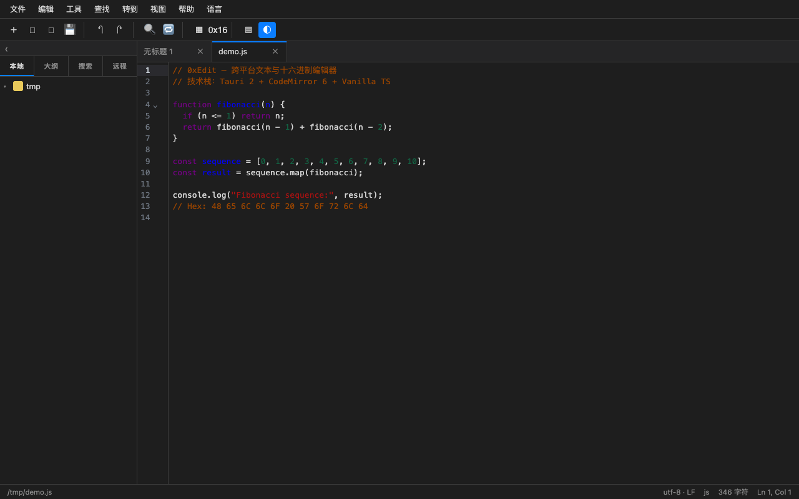
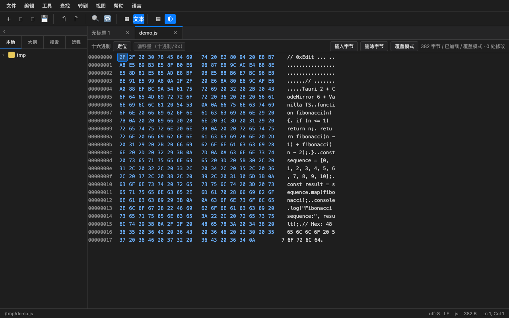
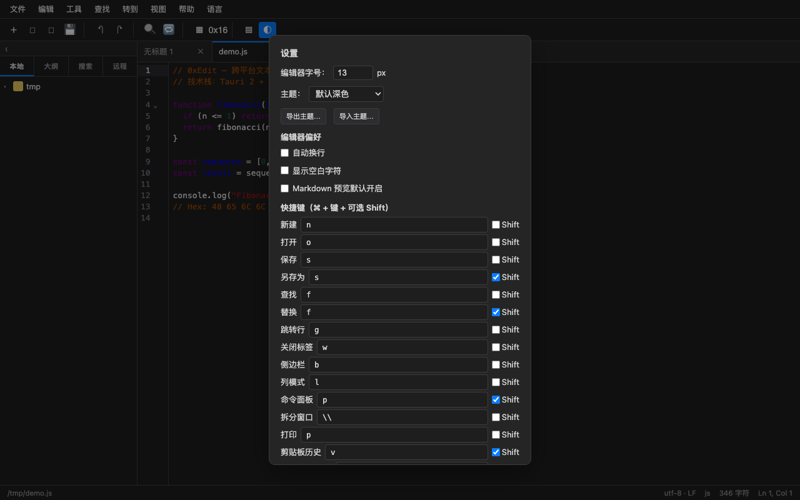
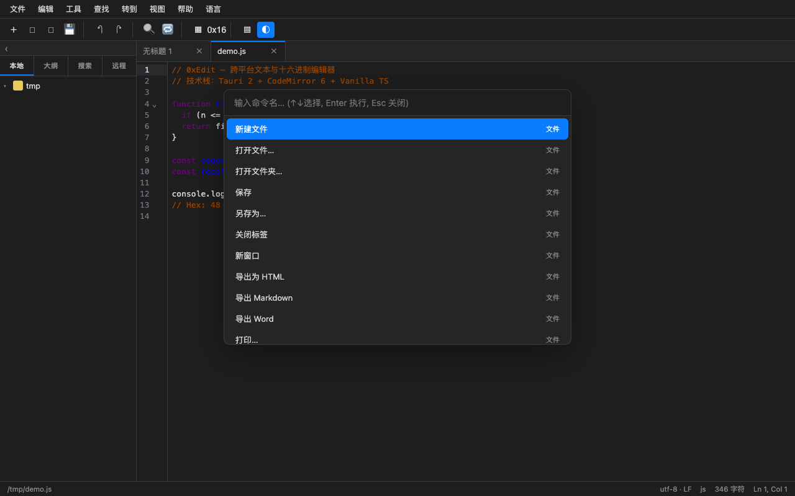

# 0xEdit


[](https://github.com/zhpeace/0xEdit/actions/workflows/ci.yml)

基于 **Tauri 2 + CodeMirror 6** 的跨平台桌面文本与十六进制编辑器。名字里的 `0x` 就是十六进制前缀——它既是产品最出彩的特色（十六进制编辑器），也是一枚烙在图标上的编辑器光标。

## ✨ 功能一览

| 类别 | 能力 |
|---|---|
| **核心编辑** | 多标签页 + 文件树、40+ 语言语法高亮、查找/替换（正则）、列编辑模式、十六进制编辑器、编码检测/转换（UTF-8/16、GBK）、8 套内置主题（含 UltraEdit 经典、Solarized、Monokai 等） |
| **文本工具** | 代码折叠、书签、行操作/排序、大小写转换、JSON/HTML/XML 格式化、Base64/URL 编解码、拆分窗口、多光标 |
| **跨文件与远程** | 跨目录查找替换、并排 diff 与合并、目录同步/比较、FTP/SFTP 远程文件树（私钥认证、加密传输、远程直接编辑回写） |
| **自动化** | 宏录制/回放、JS 脚本、命令面板、Snippets、拼写检查、外部工具/终端集成 |
| **可靠性** | 自动保存、崩溃恢复、会话记忆、多窗口、打印/导出 PDF |

完整功能清单见 [FEATURES.md](./FEATURES.md)。

## 📸 截图预览

| 代码编辑 | 十六进制编辑器 |
|---|---|
|  |  |

| 设置面板（8 套主题） | 命令面板 |
|---|---|
|  |  |

## 🛠 技术架构

| 层 | 技术 |
|---|---|
| 桌面壳 | Tauri 2（Rust 后端：FTP/SFTP、编码转换、目录遍历） |
| 前端 | Vanilla TypeScript + Vite（无框架，`src/app.ts` 为主控制器） |
| 编辑器引擎 | CodeMirror 6 |

```
src/            前端源码（模块化，按功能拆分）
src-tauri/      Rust 后端（lib.rs + Tauri 配置）
tests/          单元测试（Node）与 Playwright 冒烟测试
dist/           Vite 构建产物
```

## 环境要求

- Node.js ≥ 18
- Rust（stable）
- macOS 打包需要 Xcode Command Line Tools；跨平台打包需对应平台工具链

## 快速开始

```bash
# 安装依赖
npm install

# 开发模式（浏览器，仅前端）
npm run dev

# 桌面开发模式（Tauri 窗口，自动起前端）
npm run tauri dev

# 类型检查 + 构建前端产物
npm run build

# 打包桌面应用（.app / .dmg 等，产物在 src-tauri/target/release/bundle）
npm run tauri build
```

## 测试

```bash
# 全部测试：单元测试 + 端到端冒烟 + Rust 后端测试
npm test

# 仅单元测试（纯 Node，无需浏览器）
npm run test:unit

# 仅端到端冒烟（自动启动 dev server 并依次运行 5 个 Playwright 测试后关闭）
npm run test:e2e

# 仅 Rust 后端测试
npm run test:rust

# 单独运行某个冒烟测试（需先手动启动 dev server：npm run dev）
npm run test:i18n      # 三语界面
npm run test:merge     # 目录比较/合并
npm run test:markdown  # Markdown 预览/导出
npm run test:core      # 十六进制/宏/命令面板/编码转换
npm run test:verify    # 端到端功能验证
```

## 发布

```bash
npm run tauri build
```

macOS 产物输出于 `src-tauri/target/release/bundle/macos/*.app` 与 `dmg/*.dmg`。

## License

[MIT](./LICENSE)
